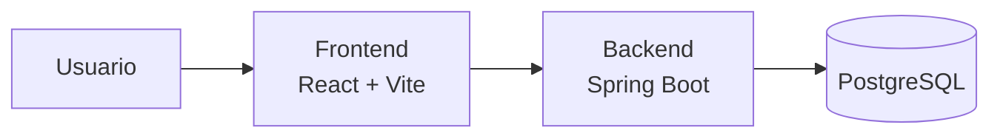
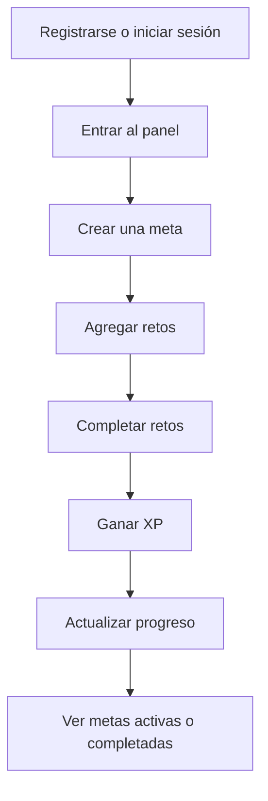
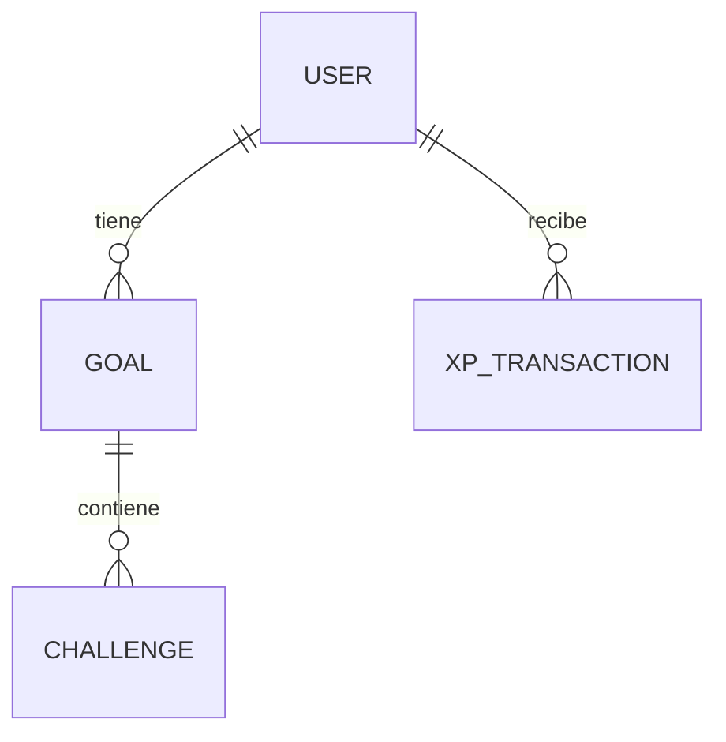

# AI LifeQuest

AI LifeQuest es una aplicación para convertir metas personales en una experiencia tipo juego. La idea es sencilla: creas una meta, la divides en retos, completas avances y ganas XP mientras ves tu progreso crecer.

El proyecto está construido como una aplicación completa con frontend, backend y base de datos. Fue pensado como entrega de trabajo académico, pero con una estructura suficientemente clara para seguir creciendo.

## Qué puedes hacer

- Crear una cuenta e iniciar sesión.
- Mantener la sesión abierta aunque recargues la página.
- Crear metas con categoría, descripción y fecha límite.
- Agregar retos dentro de cada meta.
- Completar retos y ganar XP.
- Ver metas activas y metas completadas.
- Consultar estadísticas de progreso desde el perfil.

## Vista General



El frontend se encarga de la experiencia visual y el backend guarda la información real en PostgreSQL. Ya no se trabaja con datos simulados para el flujo principal.

## Flujo De Uso



## Modelo Del Proyecto



## Estructura Del Repositorio

```text
AILifeQuest/
├── ai-lifequest-backend/    # API REST con Spring Boot
├── ai-lifequest-frontend/   # Interfaz web con React + Vite
└── README.md                # Guía principal del proyecto
```

## Tecnologías

**Frontend**

- React
- TypeScript
- Vite
- Axios
- Lucide React

**Backend**

- Java 17
- Spring Boot 3
- Spring Web
- Spring Data JPA
- PostgreSQL
- Maven

## Requisitos

Antes de ejecutar el proyecto necesitas tener instalado:

- Java 17
- Maven
- Node.js y npm
- PostgreSQL

La base de datos esperada se llama:

```text
lifequest_db
```

Y la configuración local por defecto usa:

```text
usuario: postgres
contraseña: postgres
puerto: 5432
```

## Preparar PostgreSQL

En Linux puedes crear la base así:

```bash
sudo -u postgres psql
CREATE DATABASE lifequest_db;
ALTER USER postgres WITH PASSWORD 'postgres';
\q
```

También hay guías más detalladas dentro del backend:

- `ai-lifequest-backend/POSTGRES_SETUP.md`
- `ai-lifequest-backend/POSTGRES_SETUP_WINDOWS.md`

## Ejecutar El Proyecto

Lo más cómodo es usar dos consolas: una para el backend y otra para el frontend.

### 1. Backend

```bash
cd ai-lifequest-backend
mvn spring-boot:run
```

El backend queda disponible en:

```text
http://localhost:8080
```

### 2. Frontend

```bash
cd ai-lifequest-frontend
npm install
npm run dev
```

El frontend queda disponible normalmente en:

```text
http://localhost:5173
```

## Cómo Probar La App

1. Abre `http://localhost:5173`.
2. Entra a la pestaña de registro.
3. Crea un usuario con una contraseña de mínimo 6 caracteres.
4. Crea una meta.
5. Agrega retos a esa meta.
6. Completa retos para ganar XP.
7. Recarga la página y verifica que la sesión se mantiene.

Los usuarios de prueba antiguos ya no aplican para el flujo principal, porque el frontend ahora trabaja contra el backend real y PostgreSQL.

## API Principal

| Método | Endpoint | Uso |
| --- | --- | --- |
| POST | `/api/auth/register` | Registrar un usuario |
| POST | `/api/auth/login` | Iniciar sesión |
| GET | `/api/users?userId=...` | Consultar usuario |
| POST | `/api/goals` | Crear meta |
| GET | `/api/goals?userId=...` | Listar metas de un usuario |
| POST | `/api/challenges` | Crear reto |
| GET | `/api/challenges?goalId=...` | Listar retos de una meta |
| PATCH | `/api/challenges/complete` | Completar reto y ganar XP |
