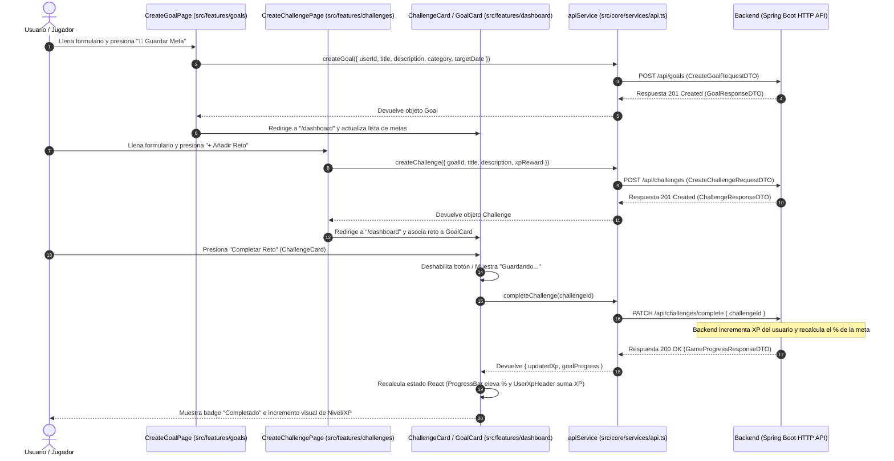

```mermaid
sequenceDiagram
    autonumber
    actor Jugador as Usuario / Jugador
    participant GoalUI as CreateGoalPage (src/features/goals)
    participant ChallengeUI as CreateChallengePage (src/features/challenges)
    participant CardUI as ChallengeCard / GoalCard (src/features/dashboard)
    participant API as apiService (src/core/services/api.ts)
    participant Back as Backend (Spring Boot HTTP API)

    %% 1. Creación de Meta
    Jugador->>GoalUI: Llena formulario y presiona "🚀 Guardar Meta"
    GoalUI->>API: createGoal({ userId, title, description, category, targetDate })
    API->>Back: POST /api/goals (CreateGoalRequestDTO)
    Back-->>API: Respuesta 201 Created (GoalResponseDTO)
    API-->>GoalUI: Devuelve objeto Goal
    GoalUI->>CardUI: Redirige a "/dashboard" y actualiza lista de metas

    %% 2. Creación de Reto
    Jugador->>ChallengeUI: Llena formulario y presiona "+ Añadir Reto"
    ChallengeUI->>API: createChallenge({ goalId, title, description, xpReward })
    API->>Back: POST /api/challenges (CreateChallengeRequestDTO)
    Back-->>API: Respuesta 201 Created (ChallengeResponseDTO)
    API-->>ChallengeUI: Devuelve objeto Challenge
    ChallengeUI->>CardUI: Redirige a "/dashboard" y asocia reto a GoalCard

    %% 3. Completar Reto y Actualizar Experiencia/Progreso
    Jugador->>CardUI: Presiona "Completar Reto" (ChallengeCard)
    CardUI->>CardUI: Deshabilita botón / Muestra "Guardando..."
    CardUI->>API: completeChallenge(challengeId)
    API->>Back: PATCH /api/challenges/complete { challengeId }
    Note over Back: Backend incrementa XP del usuario y recalcula el % de la meta
    Back-->>API: Respuesta 200 OK (GameProgressResponseDTO)
    API-->>CardUI: Devuelve { updatedXp, goalProgress }
    CardUI->>CardUI: Recalcula estado React (ProgressBar eleva % y UserXpHeader suma XP)
    CardUI-->>Jugador: Muestra badge "Completado" e incremento visual de Nivel/XP
```