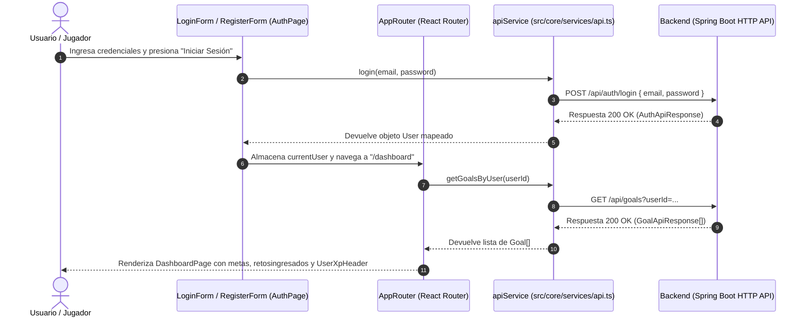

```mermaid
sequenceDiagram
    autonumber
    actor Jugador as Usuario / Jugador
    participant AuthUI as LoginForm / RegisterForm (AuthPage)
    participant Router as AppRouter (React Router)
    participant API as apiService (src/core/services/api.ts)
    participant Back as Backend (Spring Boot HTTP API)

    Jugador->>AuthUI: Ingresa credenciales y presiona "Iniciar Sesión"
    AuthUI->>API: login(email, password)
    API->>Back: POST /api/auth/login { email, password }
    Back-->>API: Respuesta 200 OK (AuthApiResponse)
    API-->>AuthUI: Devuelve objeto User mapeado
    AuthUI->>Router: Almacena currentUser y navega a "/dashboard"
    Router->>API: getGoalsByUser(userId)
    API->>Back: GET /api/goals?userId=...
    Back-->>API: Respuesta 200 OK (GoalApiResponse[])
    API-->>Router: Devuelve lista de Goal[]
    Router-->>Jugador: Renderiza DashboardPage con metas, retosingresados y UserXpHeader
```